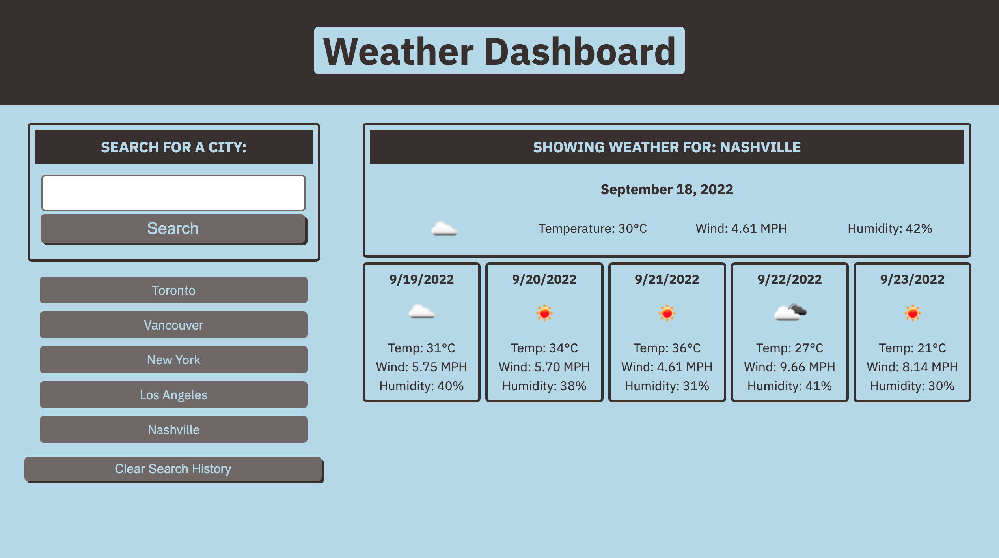

# Weather Dashboard

## Description
Weather Dashboard that displays the current weather and five-day forecast for a given city via dynamically updated HTML and CSS. Weather data is being retrieved from the OpenWeather API (openweathermap.org/api)

## License  
This application is covered under the following license. Please review the link below for additional information pertaining to the license.
    
  
https://www.gnu.org/licenses/gpl-3.0
## Table of Contents
[Deployed Application](#deployed-application)  
[Built With](#built-with)  
[Landing Page](#landing-page)  
[Contribution](#contribution)  

## Deployed Application
https://dylanhay.github.io/weather-dashboard/
## Built With
* JavaScript
* HTML
* CSS
* Git
* GitHub Pages

## Landing Page

## Contribution
Built by Dylan Hay