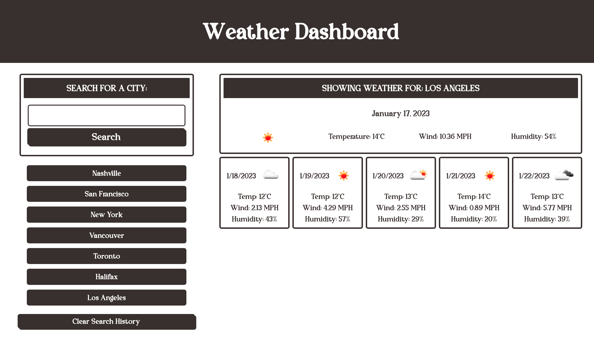

# Weather Dashboard

## Description
Weather Dashboard that displays the current weather and five-day forecast for a given city via dynamically updated HTML and CSS. Weather data is being retrieved from the OpenWeather API (openweathermap.org/api)

## Table of Contents
[Deployed Application](#deployed-application)  
[Built With](#built-with)  
[Landing Page](#landing-page)  
[Contribution](#contribution)  

## Deployed Application
https://dylanhay.github.io/weather-dashboard/
## Built With
* HTML
* CSS
* JavaScript

## Landing Page

## Contribution
Made with ❤️ by Dylan Hay